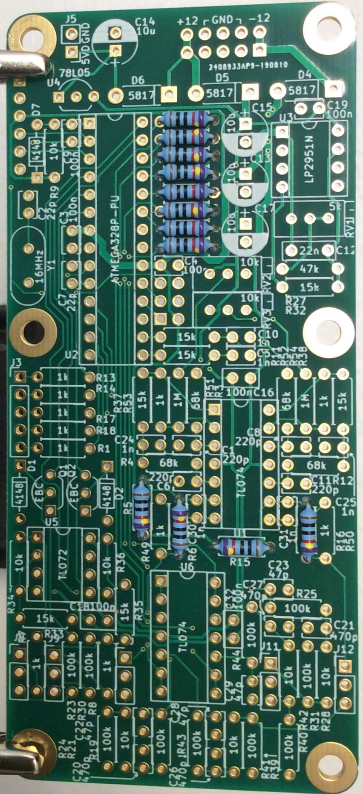
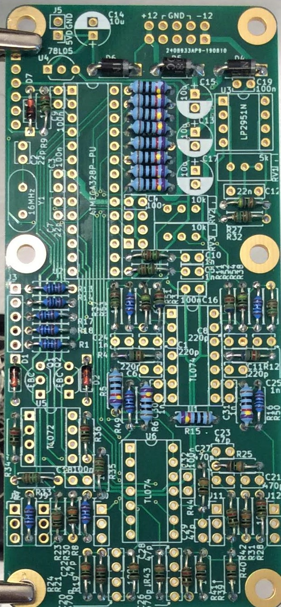
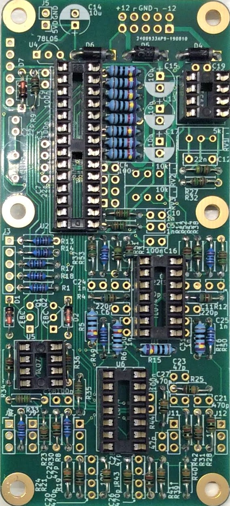
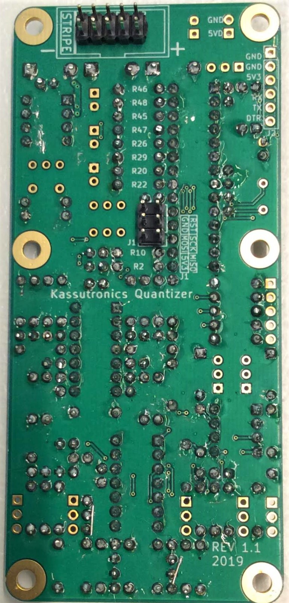
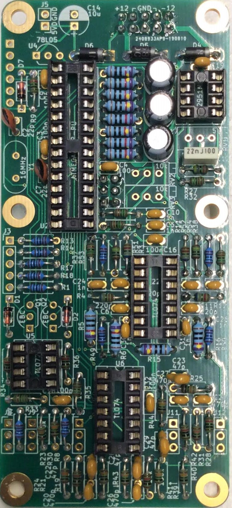
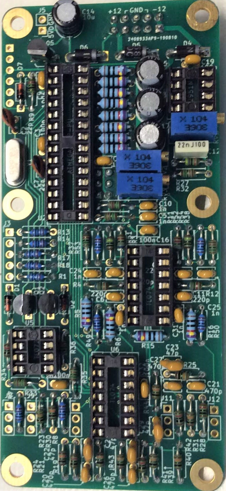
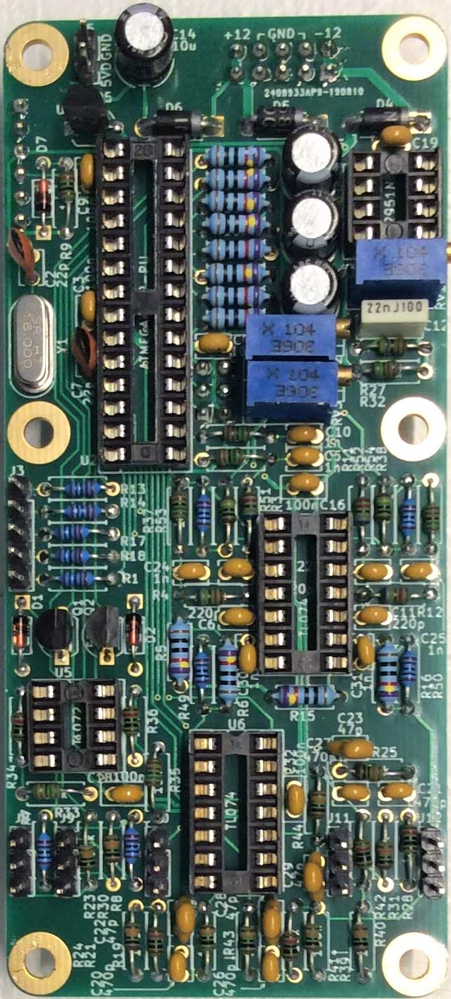
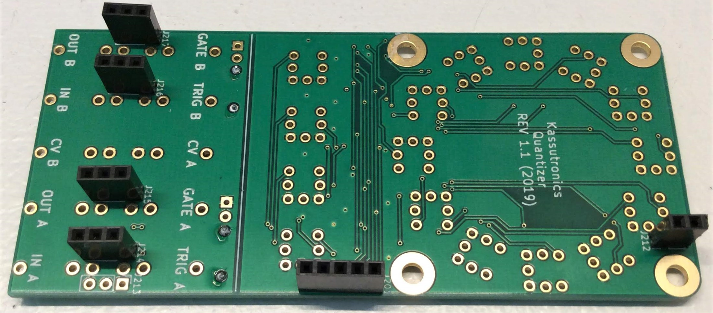
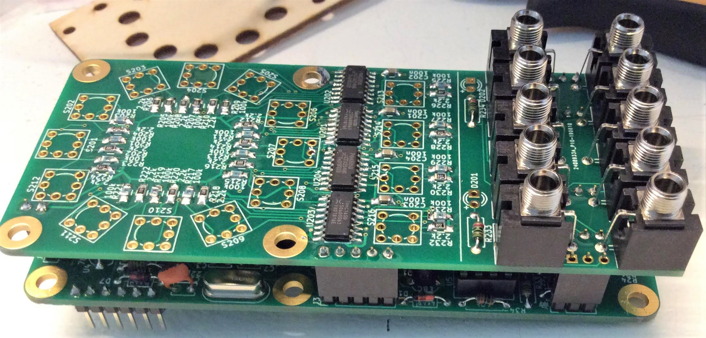
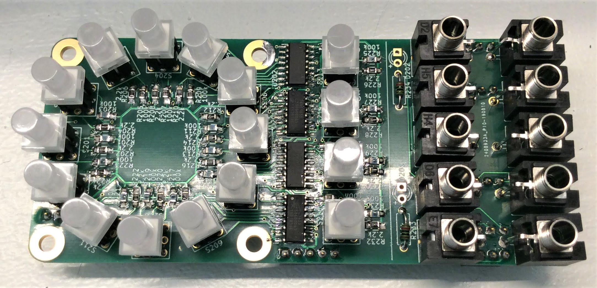

# Picture build guide

**Note:** These pictures are intended as extra help in case something is unclear. Please read the complete PDF build documentation before you start soldering!

## Main PCB

Precision (0.1%) or hand-matched resistors (12x 10k)

All other resistors 1% metal film

Diodes (3x 1N4148, 3x 1N5817)

IC sockets

A whole lot of ceramic capacitors!

Now is a good time to solder at least J1 on the backside.

Electrolytic capacitors (I forgot C14 on top) and film capacitor 

The remaining big parts: trimmers, voltage regulator, crystal

Pin headers on the frontside

Pin header J2 on the back

## Front panel PCB

Start with the ICs, SMD resistors and capacitors. Also solder the through-hole resistors now (I forgot)

Align the pin sockets before soldering using the main board as shown, and then solder J201, J212, J214, J215, J216, J217 **but DO NOT YET solder J213** 

The pin sockets are now soldered, except J213 to leave space for soldering the jack sockets

Use the front panel to align the jack sockets before soldering them down

Jack sockets are now soldered

Now you can finally solder J213, using again the main board to align it before soldering it down

Now solder the push buttons. Note that each button has 6 legs to solder, but there is a 7th hole on the PCB. The 7th hole mates with a small plastic alignment tab on the push button, which also ensures you get the right orientation.

The push buttons align quite well if you firmly press them in. Check that they are well seated before soldering, or use the front panel as a guide to align them.

!(IMG_1574.jpg)
Finally solder the LEDs. Use the front panel as a guide to determine their alignment and height. Check the Mechanical Assembly section in the build docs to see how the front panel spacings are done.

Now you are almost done! See the build docs for powerup testing, mechanical assembly, programming the microcontroller and calibration.
